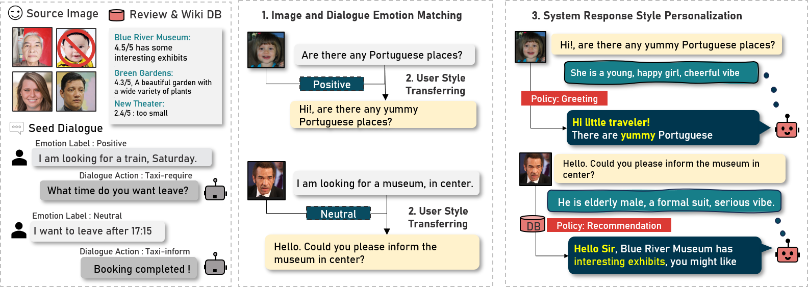

## PicPersona-TOD: A Dataset for Personalizing Utterance Style in Task-Oriented Dialogue with Image Persona



This is the official code for [PicPersona-TOD](TBD), accepted in NAACL 2025

### Overview

PicPersona-TOD is a dataset designed for generating personalized responses in task-oriented dialogue using image-based persona information.

### Dataset

Final dataset is in

```
/dataset/mwoz_sgd
```

### Citation

TBD

### Contact

For questions, feel free to reach out to <jihyunlee@postech.ac.kr>.
